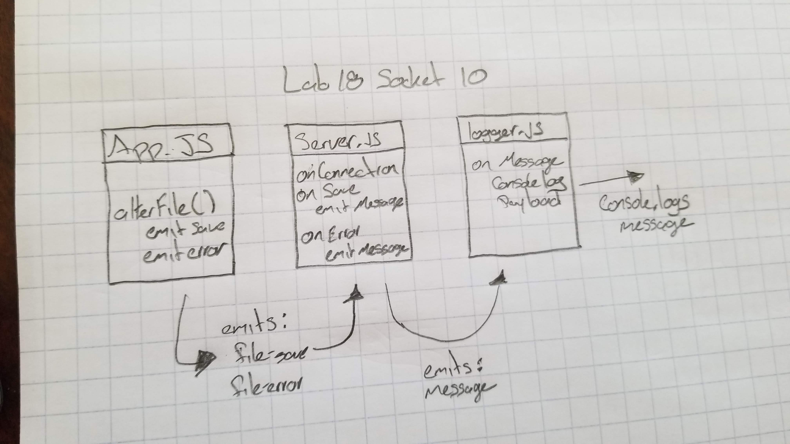

# LAB 18 socketIO

### Author: Felipe Delatorre

### Links and Resources
* [submission PR](https://github.com/401-advanced-javascript-felipe/lab18-socketIO/pull/1)
* [travis](https://travis-ci.com/401-advanced-javascript-felipe/lab18-socketIO/builds/116222105)

### Modules
#### `server.js`
Creates a socket.io server. Setups listeners for file-save and file-error events. When they occur, emit() the appropriate event and payload to clients (specficially, the ‘logger’ will pick this up).

#### `logger.js`
Creates a socket.io server for logging. Connects the logger to the socket.io server. Listens for file-save and file-error events console.log() both error and save messages.

#### `app.js`
Connects your app to the socket.io server. It reads/writes/uppercases in one module. Rather than throwing errors and console.log() inline, fire file-error and file-save events to the server that you connected to.

### Setup
#### `.env` requirements
* `PORT` - auto connects to `3000`

#### Running the app
Open 3 terminal windows

1. `npm run startServer` - This will kick off the main server. It will listen and then emit. It is listening to `file-save` and `file-error` events.
2. `npm run startLogger` - This will run the logger server. This server will listen for `file-save` and `file-error`. Once it hears the event it will console.log the message.
3. `npm start` - it will read and turn to uppercase the contents in `./files/test.txt`. Upon success it will then emit success to `server.js`.
4. (Optional) `npm run startError` - Same as `npm start` but will emit the `file-error` message
  
#### Tests
`npm test` - Will test for functions that I have written. and will mock the fs module.

#### UML

